# test-sweep screenshots — ts-20260710T182806Z

## showcase.afsd.dev (badge mode->variant rename regression check)

- 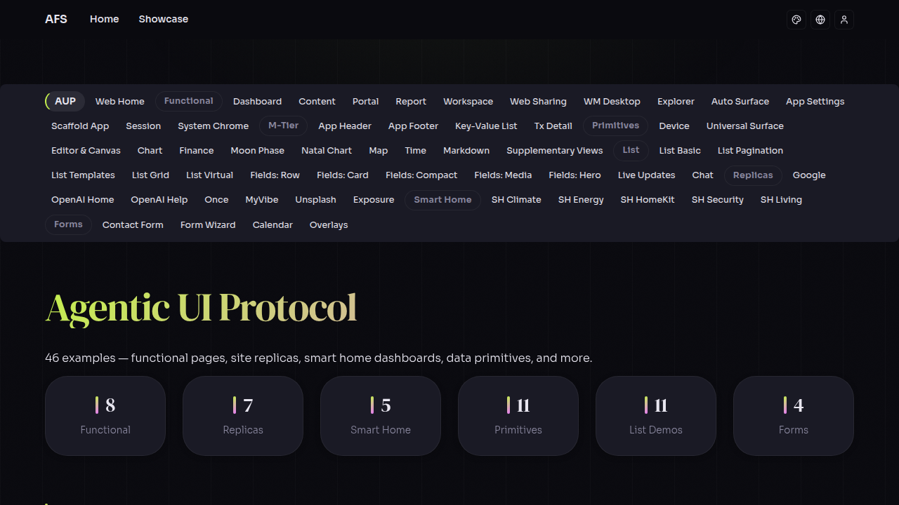
- 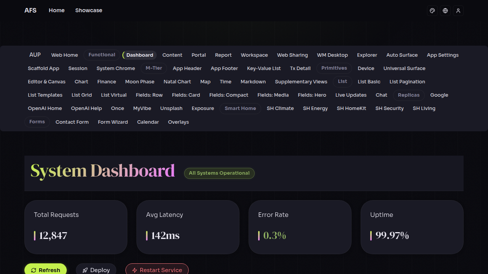
- 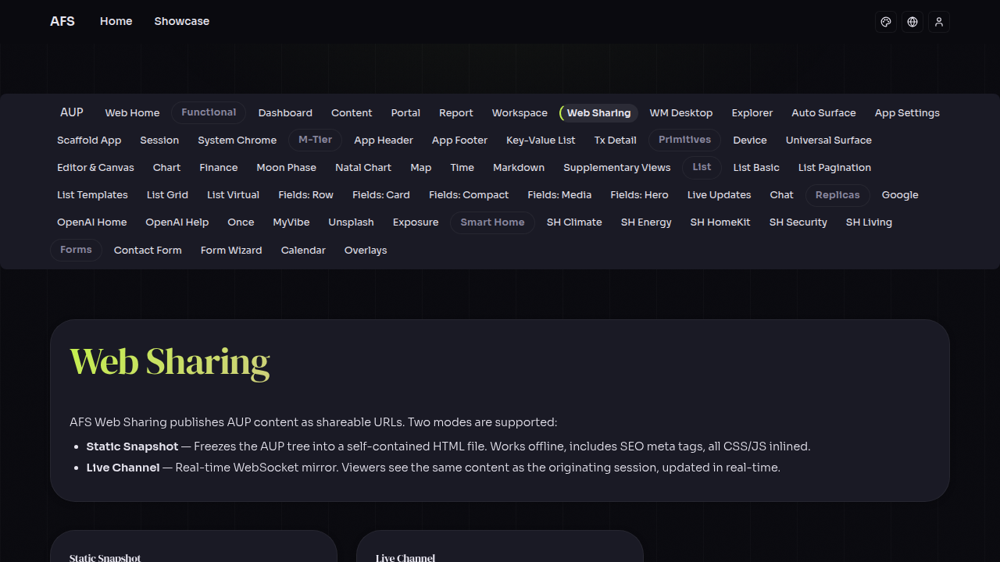
- 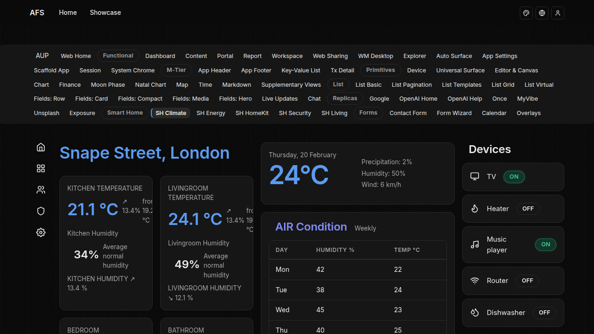
- 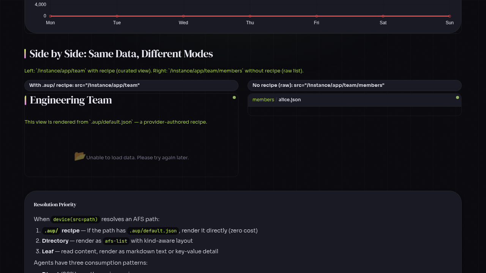
- 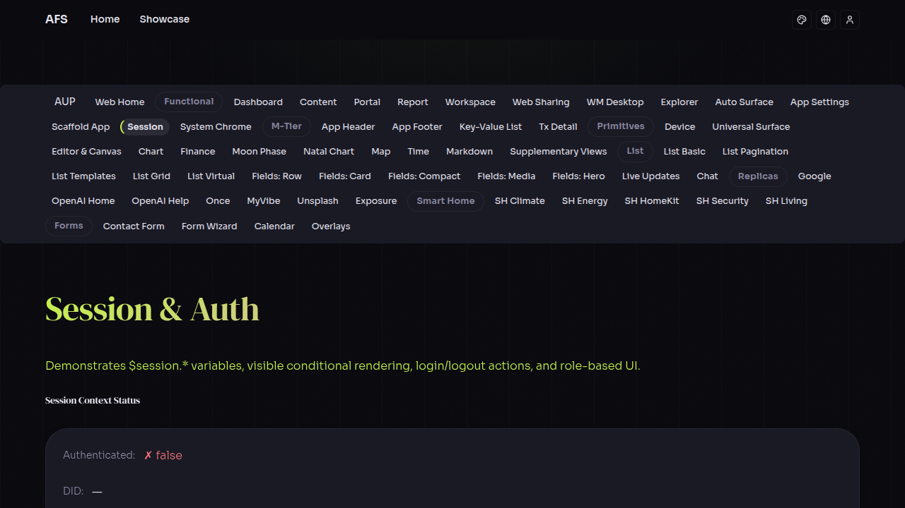

## aside.afsd.dev (host-search, feed grid, collections)

- 
- 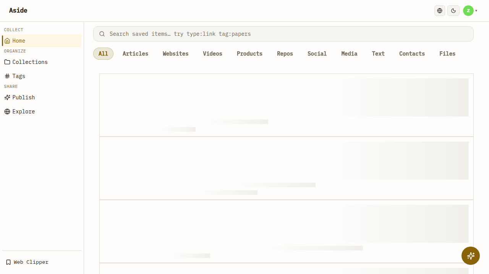
- 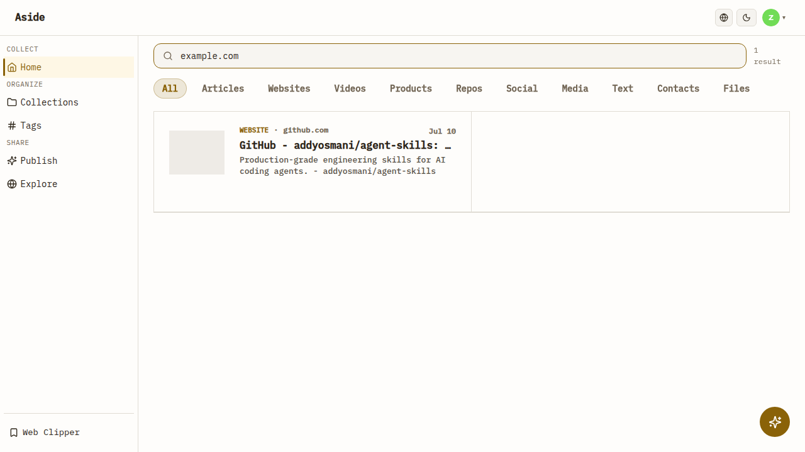
- 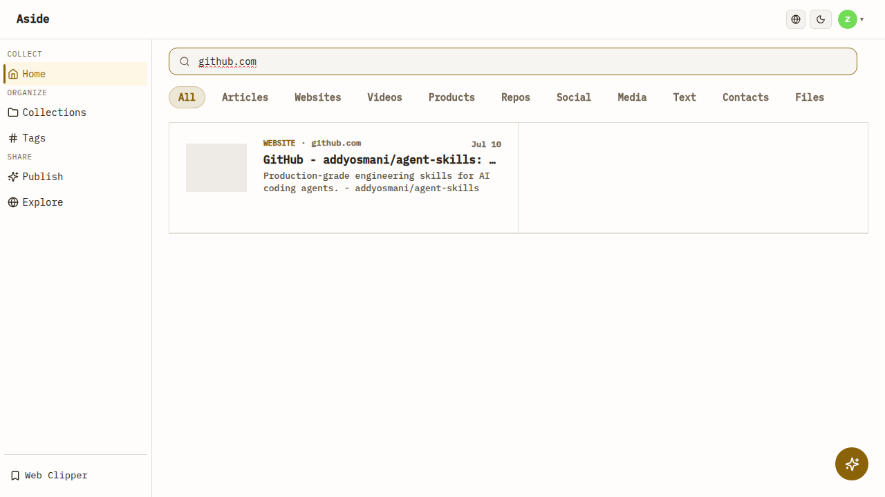
- 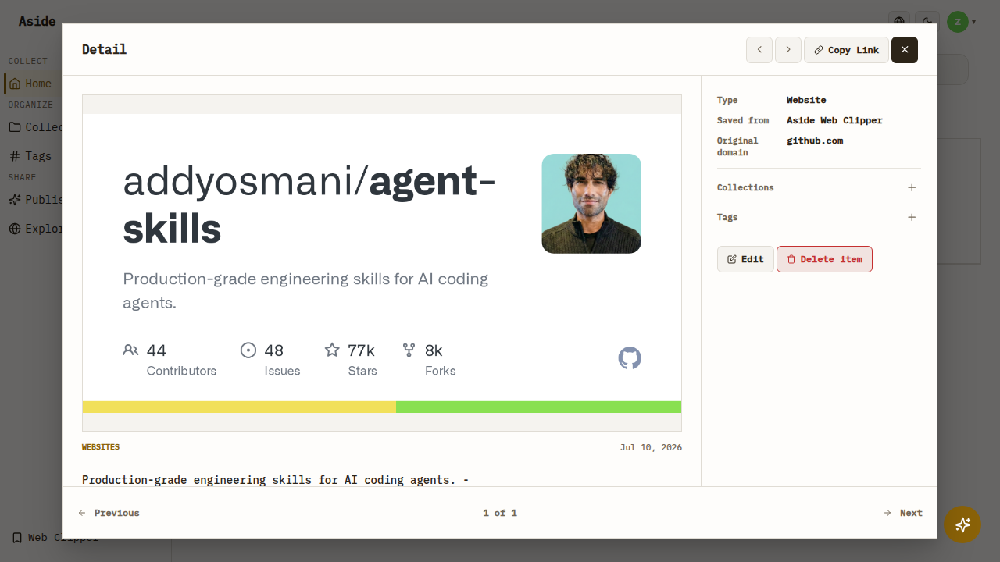
- 
- 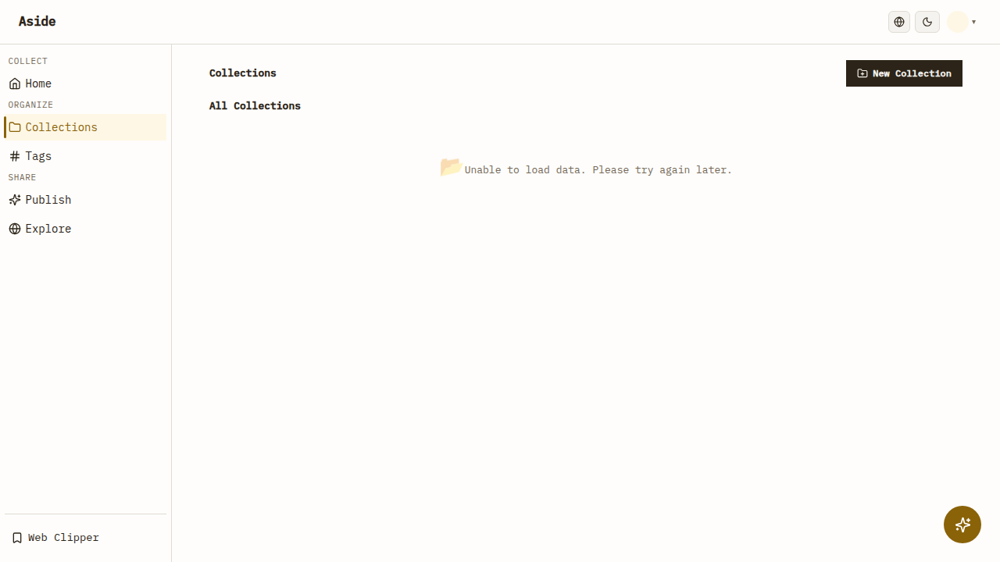
- 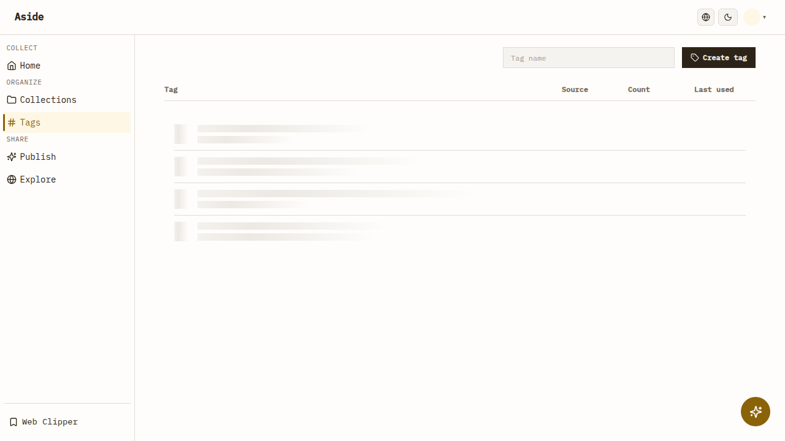
- 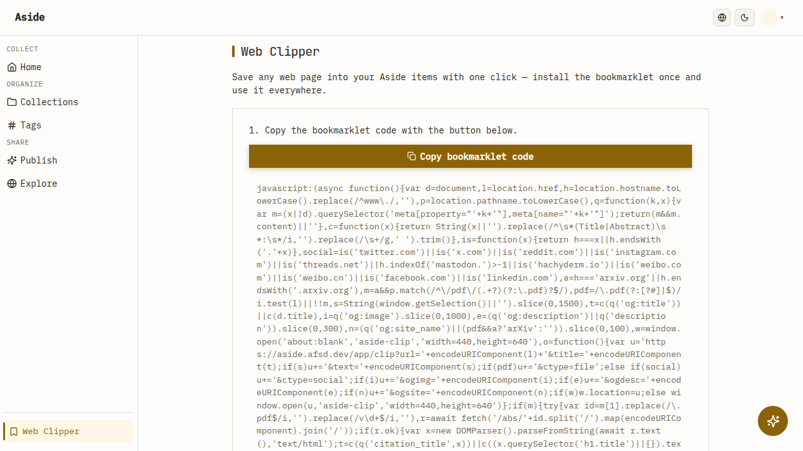
- 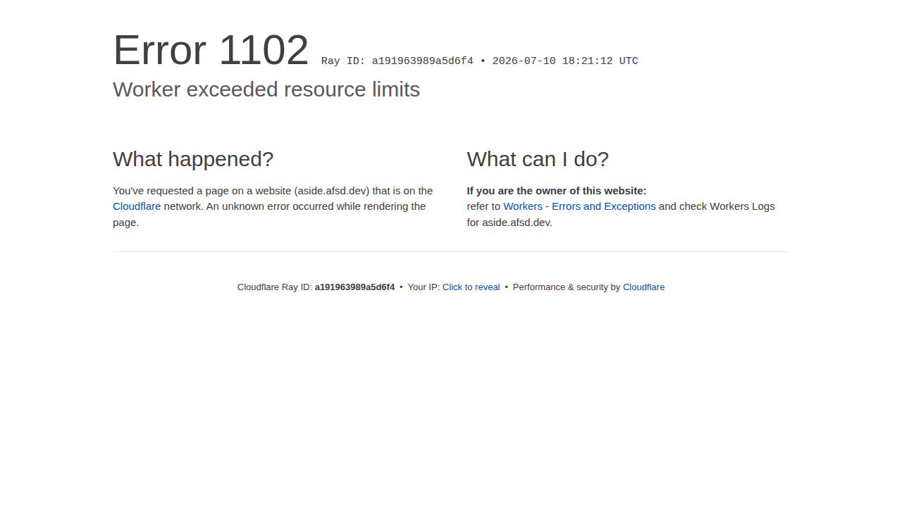
